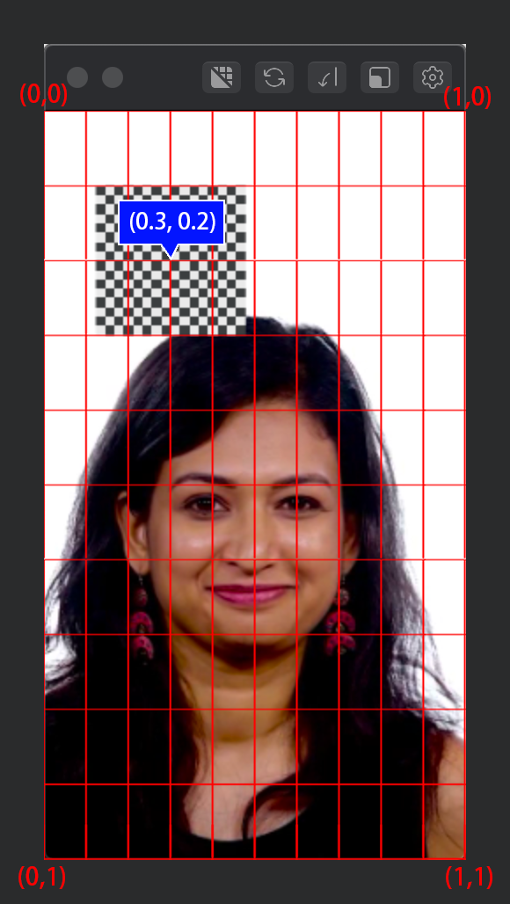

# PFScreen
PFScreen is a tool to set position of scene object with percentage of screen coord. You can use this tool to set the position of an object to ensure that all objects can be placed in the correct position on different devices.

## How to use
Just copy/paste full PFTween function to your script in Spark AR. There is only one script accepted in Spark AR.

## Example

For example, you can place a `plane0` at `(0.3, 0.2)` of screen coord. 

```javascript
const Scene = require('Scene');

const pfScreen = new PFScreen(9, 16);
const plane0 = Scene.root.find('plane0');

// Set plane0's inital position.
pfScreen.subscribe(adaptor => {
  plane0.transform.x = adaptor.GetX(0.3);
  plane0.transform.y = adaptor.GetY(0.2);
});
```

You need to decide the base ratio. 

In this example, it's `(9,16)` or `(375, 667) `, the ratio of iPhone 8.

The origin is on Top-Left.
